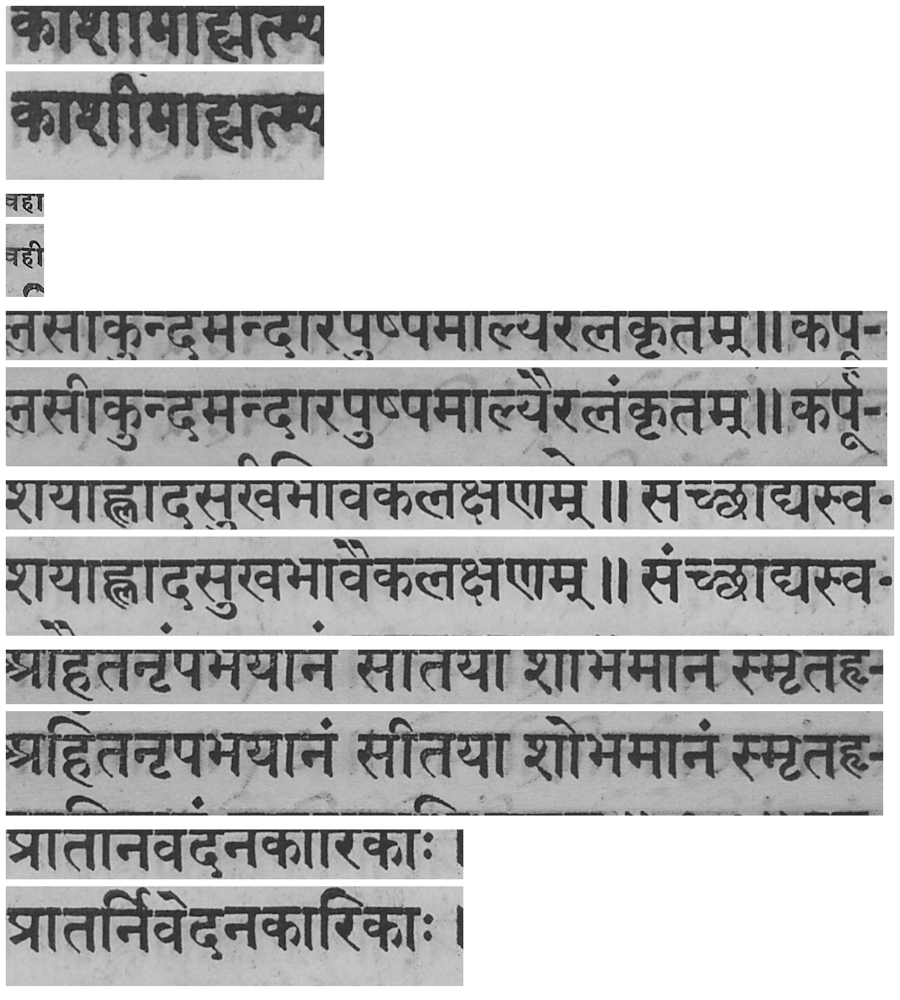
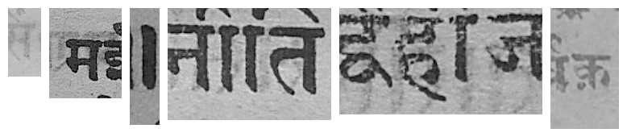
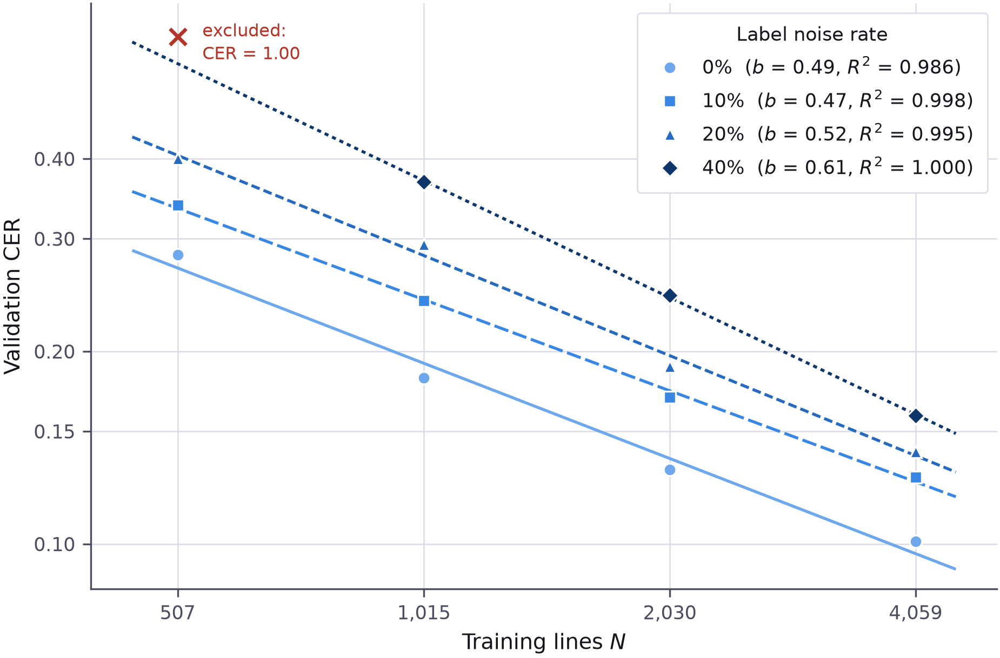
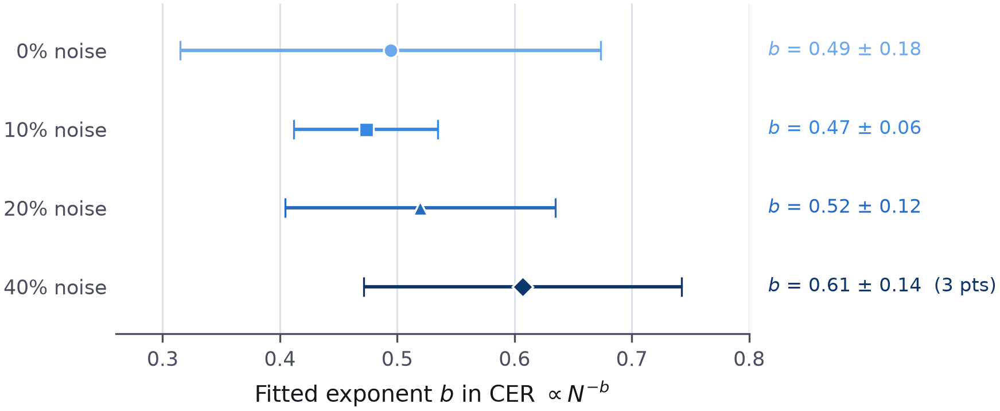

# Scaling Laws for OCR under Label Noise

[](https://colab.research.google.com/github/Rehanabbaxi/ocr-scaling-laws-label-noise/blob/main/notebook.ipynb)
[](LICENSE)
[](https://creativecommons.org/licenses/by/4.0/)

How does optical character recognition error scale with **training set size** when a
known fraction of the training labels is **wrong**?

This repository holds the data pipeline and (in progress) the training code for a
controlled study on historical printed Devanagari. Everything is built so that a
single run is one point on a curve, and the curve is the result.

**Status:** pipeline complete, 65 tests passing, **full 4x4 sweep run**. Baseline clears
its success criterion at 10.1 % validation CER, and across 0-40 % label noise the error
curve is **raised but not flattened**. See [Sweep results](#5-sweep-results-the-scaling-curves)
and [Roadmap](#8-roadmap).

---

## 1. The research question

Real OCR ground truth is never clean — human transcribers mistype, and automatic
alignment tools misalign. The practical question this raises is:

> When labels are noisy, does collecting more data still help — and how much more
> data is needed to offset a given noise rate?

The experiment holds everything fixed and sweeps two axes:

| Axis | Config key | Values |
| --- | --- | --- |
| Training data seen | `data_fraction` | 0.125, 0.25, 0.5, 1.0 |
| Label noise rate | `noise_rate` | 0.0, 0.1, 0.2, 0.4 |

Each of the 16 cells produces one validation CER (Character Error Rate). Fitting a
curve through them gives the scaling law; comparing curves across noise rates answers
the question.

### Noise models

Noise is injected into the **training split only**. Validation and test labels are
never touched — measuring against corrupted targets is meaningless.

- **`char_flip`** — symmetric character-level corruption. Each character is replaced,
  independently with probability *r*, by a character drawn uniformly from the rest of
  the alphabet. Formally a symmetric noise transition matrix with diagonal `1 - r` and
  off-diagonal `r / (V - 1)`.
- **`line_swap`** — a selected subset of lines has its labels permuted among themselves
  via a derangement, so no line keeps its own transcription. Models misalignment rather
  than mistyping.

Both are seeded from `noise_seed`, kept **separate from** the training seed so noise
and initialisation can be varied independently.

### Design constraints

These are deliberate and load-bearing. Breaking any one of them invalidates the curve.

| Constraint | Reason |
| --- | --- |
| Train from scratch; no pretrained weights | A pretrained model has already consumed an unknown, large corpus. That destroys the "data seen" x-axis. |
| No data augmentation (`augment: False`) | Augmentation changes the effective dataset size — the exact quantity being measured. |
| Every run appends one row to a results file | A scaling law is fitted across many runs; results that live only in notebook output are lost on disconnect. |
| Every randomness source seeded and logged | Runs must be comparable across data sizes and noise rates. An unseeded run is a wasted run. |
| `dataset` is a task identifier, **not** a scaling axis | Each script has a different alphabet and different intrinsic difficulty. Devanagari and Malayalam are points on *different* curves and must never be pooled into one fit. |

---

## 2. Data

**Source:** [FID4SA-GT — Ground truth data for HTR on South Asian Scripts](https://heidata.uni-heidelberg.de/dataverse/FID4SA-GT),
heiDATA, Heidelberg University.
**Subset used:** Printed Devanagari — `doi:10.11588/data/EGOKEI`

Letterpress printings from the **Naval Kishore Press** (Lakhnau, North India), late 19th
to early 20th century, in Hindi, Sanskrit, Braj Bhasha and Awadhi. Each page ships as a
JPEG scan plus an XML transcription giving per-line coordinates and text.

The corpus is **not redistributed here** (approximately 1.5 GB). See
[Reproducing the data](#6-reproducing-the-data) to rebuild it from the DOI; the pipeline
is deterministic and reproduces the manifests byte-identically.

### As received

| | |
| --- | --- |
| Books | 19 |
| Pages (JPEG + XML pairs) | 247 |
| `TextLine` elements | 5,142 |
| XML format | ALTO v4 — 18 books, 4,858 lines |
| | PAGE 2013-07-15 — 1 book (`vyasa1906`), 284 lines |

Both formats are parsed. They differ structurally: ALTO stores geometry as a rectangle
and text in a `CONTENT` attribute; PAGE stores geometry as a polygon and text in a
`<Unicode>` child element. Namespaces are mandatory in both — plain tag matching
silently returns nothing.

---

## 3. Preprocessing

Run order, with the reason each step exists.

### 3.1 Schema inspection (before any parser was written)

`src/inspect_xml.py` dumps root tags, namespace maps and sample `TextLine` elements
across the corpus. A parser cannot be written correctly against an assumed schema —
this step is what discovered that one book uses PAGE rather than ALTO. Output is
committed at [`inspect/stage1_xml_inspection.txt`](inspect/stage1_xml_inspection.txt).

### 3.2 Line extraction

Pages are cropped into individual line images. A page-level image is not a usable
training unit for a CTC recogniser; a line is.

For PAGE polygons the **axis-aligned bounding box** is taken. No polygon masking and no
dewarping — both are accuracy tricks that add uncontrolled variables to a measurement
study.

Crops are converted to grayscale (colour carries no signal for character identity and
triples the I/O) and saved as lossless PNG.

### 3.3 Crop padding — a correction to the original specification

The specification called for a flat 2-pixel pad around each bounding box. **This was
wrong for this corpus.** The ground-truth boxes bound the base glyph band and exclude
the superscript vowel marks (*matras*) that sit above it.



*Each pair: original 2 px pad above, corrected pad below. The upper crop of each pair is
missing the marks that sit over the letter body.*

This matters more than it appears. A crop missing a matra, paired with a label that
contains that matra, asks the model to predict a character that is **not present in the
image**. It teaches noise, and it does so silently.

The fix: pad **proportionally to box height** — 55 % of the height above, 25 % below —
clamped at the midpoint to any vertically adjacent line sharing horizontal extent, so a
crop can never swallow its neighbour. Implemented in
[`compute_crop_boxes`](src/extract.py). Per-line audit at
[`inspect/crop_edge_audit.csv`](inspect/crop_edge_audit.csv).

### 3.4 Filtering

A line is dropped if any of the following hold:

| Condition | Reason | Dropped |
| --- | --- | ---: |
| Text is empty or whitespace only | No target to learn | 13 |
| CTC-infeasible (see below) | Label cannot be produced from the image | 76 |
| Height < 8 px or width < 16 px | Degenerate crop | 0 |
| Bounding box outside the image | Bad coordinates | 0 |
| Aspect ratio (w/h) > 60 | Almost certainly a merged multi-line region | 0 |
| Text length > 200 characters | Same | 0 |
| | **Total** | **89 / 5,142 (1.73 %)** |

Well inside the 10 % gate above which the specification says to suspect the parser
rather than the data.

**The CTC feasibility filter.** A CRNN reads a line image as a sequence of vertical
slices and emits one prediction per slice; CTC then collapses that sequence into the
output string. This imposes a hard requirement: **the number of slices must exceed the
number of target characters.** After resizing to `img_height = 32` and applying the
CNN's 4x horizontal downsampling, a crop of width *w* yields `ceil(w / 4)` timesteps.
Lines where timesteps fall below `1.2 * len(text)` are discarded.



*Dropped lines. Each crop is a few characters wide; each label claims a full line of
text. These are annotation errors — the coordinates and the transcription disagree.*

Retaining them would feed the model impossible targets, producing infinite CTC loss that
`zero_infinity` silently masks — a failure mode that corrupts training without raising
an error.

Every drop is logged with its reason to `manifests/devanagari_drops.csv`.

### 3.5 Text normalisation

Applied **before anything else touches the text**, so the manifest stores
already-normalised strings and no downstream stage normalises a second time.

1. Unicode **NFC** normalisation
2. Whitespace runs collapsed to a single space; leading and trailing space stripped
3. Zero-width joiner / non-joiner (U+200D / U+200C) stripped — decision recorded in
   `strip_zero_width_joiners` and applied consistently

NFC is not optional for Indic scripts. The same visible Devanagari cluster can be
encoded as different codepoint sequences. Without normalisation the vocabulary inflates
with duplicates, identical strings compare as unequal, and CER is computed against an
inconsistent target.

### 3.6 Vocabulary

Built from the **training split only**, after normalisation. Index 0 is reserved for the
CTC blank; characters take 1..C; a single `<unk>` index absorbs anything unseen so
val/test cannot crash the encoder.

| | |
| --- | --- |
| Characters (C) | 119 |
| Symbols including `<unk>` (V) | 120 |
| Output classes (V + 1, including blank) | 121 |

Coverage of the held-out splits by the training charset:

| Split | Unseen characters | Rate |
| --- | --- | --- |
| val | 1 of 16,066 (the digit `4`) | 0.006 % |
| test | 0 of 17,898 | 0.000 % |

Saved to `manifests/devanagari_vocab.json`.

### 3.7 Splitting — by page, never by line

Lines from the same page share typeface, ink, scan quality and page-level artefacts.
Splitting randomly at line level places near-identical lines in both train and test,
which **leaks** and inflates the score.

Whole pages are therefore assigned to a split, and the three page sets are asserted
disjoint at runtime.

| Split | Pages | Lines | Characters | Mean chars/line |
| --- | ---: | ---: | ---: | ---: |
| train | 197 | 4,059 | 152,457 | 37.6 |
| val | 25 | 502 | 16,066 | 32.0 |
| test | 25 | 492 | 17,898 | 36.4 |
| **Total** | **247** | **5,053** | **186,421** | |

### 3.8 The scaling axis

`subsample_train` draws a seeded subset of the training split. Because the seed is
fixed, a given fraction is identical across runs and across noise rates:

| `data_fraction` | Train lines |
| --- | ---: |
| 0.125 | 507 |
| 0.25 | 1,015 |
| 0.5 | 2,030 |
| 1.0 | 4,059 |

**4,059 lines is the ceiling**, and it directly limits how far the curve can extend.
This is a small-data scaling study by construction.

---

## 4. Baseline result

`data_fraction = 1.0`, `noise_rate = 0.0`, seed 42, on a Colab T4. This is the
zero-noise, full-data corner of the grid — the reference point every other run is
measured against.

| | |
| --- | --- |
| **Validation CER** | **0.1008** |
| **Test CER** | **0.1124** |
| Validation WER | 0.3063 |
| Test WER | 0.2914 |
| Best epoch | 33 (early-stopped at 45 of 60) |
| Parameters | 10,077,753 |
| Training time | 15.2 min |
| Non-finite batches | 0 |

The success criterion was validation CER below ~30 %, with below 10 % counted as good.
Full record in [`results/`](results/); per-epoch history in
`results/devanagari_d100_none00_s42_history.csv`.

### Reading the curve

| Epoch | Train loss | Val CER |
| ---: | ---: | ---: |
| 1 | 4.066 | 1.0000 |
| 5 | 1.699 | 0.3827 |
| 10 | 0.543 | 0.1564 |
| 20 | 0.120 | 0.1141 |
| 33 | 0.0045 | **0.1008** |
| 45 | 0.0018 | 0.1014 |

Three things this says, all of which matter for the sweep:

1. **The model is data-limited, not capacity- or time-limited.** Training loss reaches
   0.0018 — effectively memorisation — while validation CER plateaus at 0.10 from around
   epoch 30. Adding epochs or parameters will not move that plateau; only more data will.
   That is precisely the regime a scaling-law study needs to be in.
2. **The 60-epoch budget is sufficient.** Early stopping triggered at 45 with the best
   model at 33, so no run is being cut short by the epoch cap.
3. **Corpus CER and per-line mean CER agree** (0.10083 vs 0.10092), meaning error is
   spread evenly across line lengths rather than concentrated in short lines.

### A known floor in the ground truth

Six of the 5,053 lines are bare page numbers transcribed with **Latin** digits, while the
other 1,424 digit-bearing lines use **Devanagari** numerals — one inconsistent line in
each of six different books. Those six lines are unlearnable: the image shows `१८६` and
the label says `186`. They also account for the six Latin digit classes in the 119-character
vocabulary.

The effect is roughly 20 characters out of 186,421, which moves CER in the fourth decimal
place. It is recorded here rather than corrected, since the correction would be invisible
and the manifest is deliberately a faithful derivative of the source transcriptions.

---

## 5. Sweep results: the scaling curves

Sixteen runs — four training-set sizes by four `char_flip` noise rates, seed 42,
114.8 GPU-minutes on a Colab T4, zero non-finite batches. Fifteen cells are valid; one
is excluded and explained below.



**Figure 1.** Validation CER against training-set size, on log–log axes, for four label
noise rates. Markers are measured runs; lines are the fitted power laws.

### 5.1 How to read this figure

Both axes are **logarithmic**, which is what makes the figure informative rather than
decorative. A power law `CER = a · N^(-b)` becomes a straight line under logarithms:

```
log(CER) = log(a) − b · log(N)
```

so the two quantities that describe the curve become two things you can see directly:

| Reading | Quantity | Meaning |
| --- | --- | --- |
| **Slope** of a line | exponent `b` | how *fast* error falls as data grows |
| **Height** of a line | prefactor `a` | how *high* the whole curve sits |

The markers are the sixteen measured runs. The lines are **fitted**, not drawn through
the points — plotting the fit separately is what lets a reader judge how well the
power-law form actually holds, rather than taking the trend on trust.

Each series carries a distinct marker shape and dash pattern in addition to its colour
step, so the figure stays readable in greyscale print and under colour-vision
deficiency. The colour ramp is deliberately **single-hue, light to dark**: noise rate is
an ordered quantity, not four unrelated categories, and the encoding should say so.

### 5.2 Fitted parameters

| Noise rate | Points | Exponent `b` | 95 % CI | Prefactor `a` | R² |
| --- | ---: | ---: | ---: | ---: | ---: |
| 0 % | 4 | 0.494 | ± 0.179 | 5.87 | 0.9860 |
| 10 % | 4 | 0.473 | ± 0.061 | 6.38 | 0.9982 |
| 20 % | 4 | 0.520 | ± 0.115 | 10.30 | 0.9947 |
| 40 % | 3 | 0.607 | ± 0.135 | 24.71 | 0.9997 |

R² between 0.986 and 0.9997: within the range measured, the power-law form describes
these points well.

### 5.3 What the figure shows

**The four lines are near-parallel and stacked.** Noise lifts the whole curve upward
rather than tilting it. The exponents stay near 0.5 while the prefactor rises more than
fourfold, from 5.87 to 24.71.

That distinction is the result. If noise **flattened** the curve, additional data would
buy less and less as corruption rose, and collecting more would eventually stop being
worthwhile. These curves say the opposite: the return on additional data is roughly
unchanged, and noise behaves like a fixed tax on the starting point.

An exponent near 0.5 has a concrete reading: **halving the error requires roughly four
times the data**, since √4 = 2.

Inverting each fit gives the training-set size at which a noisy run would match the
clean run's 0.101 CER at 4,059 lines:

| Noise rate | CER at 4,059 | Lines to match clean | Multiplier |
| --- | ---: | ---: | ---: |
| 10 % | 0.127 | 6,392 | 1.6× |
| 20 % | 0.139 | 7,360 | 1.8× |
| 40 % | 0.159 | 8,624 | 2.1× |

The relationship is markedly **sublinear**: quadrupling the corruption rate from 10 % to
40 % raises the data requirement by about a third, not fourfold. These figures are
extrapolations beyond the measured range and are directional, not predictive.

### 5.4 The excluded run

The marker at the top left of Figure 1 is `devanagari_d012_char_flip40_s42` — 507 lines
at 40 % noise — which reported CER 1.000. It is plotted so that its exclusion is visible
rather than silent, and omitted from every fit.

Its epoch history shows training loss still falling (6.44 → 4.29) while validation CER
sat pinned at exactly 1.000. A CTC model emits only blanks for its first epochs, so CER
stays at its ceiling until the model breaks through; because `best_epoch` was 1, the
patience counter began at the first epoch and expired at 13, before that could happen.
For comparison, the same 507-line subset with no noise did not reach its best epoch
until 59.

This is a defect in the stopping rule at low signal, not a property of the corpus: early
stopping on validation CER carries no information while CER is at its ceiling. The cell
needs re-running with a corrected rule before the 40 % curve can be relied on — which is
also why that curve is fitted on three points rather than four.

### 5.5 What the exponents will and will not support



**Figure 2.** Fitted exponent per noise rate with 95 % confidence intervals. Every
interval overlaps every other interval.

The point estimates rise with noise, but that trend is **not supported by this
evidence**. With four points per fit the confidence intervals are wide and mutually
overlapping. A leave-one-out check on the clean curve makes the point concretely:
dropping any single point moves its exponent between 0.426 and 0.557 — a swing wider
than the apparent trend across all four noise levels.

**Supported:** across 0–40 % character corruption, the exponent is statistically
indistinguishable while the prefactor rises steeply. Noise raises the curve.

**Not supported:** that the exponent increases with noise.

One further caveat: a pure power law has no floor, so it predicts CER → 0 given infinite
data. Real OCR has an irreducible floor — this corpus contains six lines whose page
numbers are transcribed in Latin digits while the images show Devanagari numerals, and
those can never be read correctly. Fitting `CER = E∞ + a·N^(-b)` would be more faithful,
but three free parameters against four points is not a fit worth reporting.

### 5.6 Regenerating the figures

```bash
python scripts/make_figures.py
```

Reads `results/*.json` and writes vector PDF plus 300 dpi PNG into `figures/`. The PDFs
embed TrueType fonts (`pdf.fonttype = 42`), which most venues require, and are the ones
to use in a LaTeX manuscript:

```latex
\begin{figure}[t]
  \centering
  \includegraphics[width=\columnwidth]{figures/fig1_scaling_curves.pdf}
  \caption{Validation CER against training-set size for four label-noise rates.
           Markers are measured runs; lines are fitted power laws.}
  \label{fig:scaling}
\end{figure}
```

The script recomputes every fit from the result files, so the figures and the numbers in
this section can never drift apart.

---

## 6. Repository layout

```
src/
  config.py        every knob and path; nothing configurable is hard-coded elsewhere
  inspect_xml.py   schema inspection (detection only, extracts nothing)
  parse_xml.py     ALTO and PAGE parsers -> LineRecord
  extract.py       cropping, filtering, manifest construction
  vocab.py         NFC normalisation, charset, encode/decode
  data.py          page-level splitting, scaling-axis subsampling
  noise.py         label noise injection and measured-corruption reporting
  dataset.py       manifest rows -> padded CTC batches
  model.py         CRNN: conv stack -> bidirectional LSTM -> CTC head
  metrics.py       greedy CTC decode, corpus-level CER and WER
  train.py         training loop, evaluation, per-run results logging
scripts/
  make_figures.py  publication figures (PDF + PNG) from results/
notebook.ipynb     Colab driver: environment setup and run launching only
tests/             65 pytest cases
results/           one JSON + history CSV per run - the scientific record
figures/           generated figures; regenerate, do not hand-edit
manifests/         committed pipeline output (labels, drops, vocabulary)
inspect/           committed inspection artefacts and visual evidence
```

`src/parse_xml.py` and `src/extract.py` are the only dataset-specific layer. Nothing
downstream of the manifest references XML or page geometry, so a second script is added
by writing a parser — not by touching the training code.

### Committed manifests

| File | Contents |
| --- | --- |
| `manifests/devanagari_lines.csv` | One row per kept line: path, page_id, source_id, line_id, normalised text, width, height, n_chars |
| `manifests/devanagari_drops.csv` | One row per dropped line, with reason, bbox and text |
| `manifests/devanagari_vocab.json` | Character list and index scheme |

These are the preprocessing result. Every experimental decision downstream — splits,
subsampling, noise injection — reads the manifest and nothing else.

The committed copy is a snapshot for review. At runtime the pipeline reads and writes
manifests under `OCR_PERSISTENT_ROOT` (see [section 6](#6-reproducing-the-data)), which
defaults to a directory outside the repository so that bulk outputs and checkpoints stay
untracked.

---

## 7. Reproducing the data

```bash
pip install -r requirements.txt
```

1. Download the Printed Devanagari archive for `doi:10.11588/data/EGOKEI` from
   [heiDATA](https://heidata.uni-heidelberg.de/dataverse/FID4SA-GT). It arrives as
   `dataverse_files.zip` containing 19 per-book archives.

2. Unpack so the layout is:

   ```
   data/raw/devanagari/<book>/<book>/{*.jpg, alto/*.xml}
   ```

3. Confirm the schema, then extract:

   ```bash
   python src/inspect_xml.py     # root tags, namespaces, TextLine samples
   python src/extract.py         # line crops + manifests
   ```

   Expect `lines extracted: 5053` and `lines dropped: 89 (1.73%)`.

4. Run the tests:

   ```bash
   python -m pytest -q           # 40 passed
   ```

Outputs are written to the directory given by `OCR_PERSISTENT_ROOT` (default: a sibling
`OCR_Model_Training_output/`); bulk line crops go to `OCR_WORK_ROOT/data/lines/`. Both
are overridable by environment variable.

> **Note:** `src/extract.py` does not clear stale crops. Empty `data/lines/devanagari/`
> before re-extracting, or files dropped by a later filter revision will linger.

---

## 8. Roadmap

**Complete** — the full pipeline: schema inspection, ALTO/PAGE parsing, line extraction,
filtering, normalisation, vocabulary, page-level splitting, scaling-axis subsampling,
label noise injection, CRNN model, greedy CTC decoding, CER/WER metrics, and the
training loop with per-run results logging. 65 tests passing.

**Complete** — the baseline run at 10.1 % validation CER ([section 4](#4-baseline-result)),
the full 4x4 sweep, and the fitted scaling curves
([section 5](#5-sweep-results-the-scaling-curves)).

**Next**

1. **Fix the early-stopping rule and re-run the collapsed cell.** Hold the patience
   counter until validation CER drops below 1.0, then re-run
   `devanagari_d012_char_flip40_s42`. Until then the 40 % curve rests on three points.
2. **Repeat every cell under a second and third seed.** This is the binding constraint:
   with one run per cell there is no variance estimate, so no gap between adjacent points
   can be called real. Roughly four GPU-hours, and it converts every claim in section 5
   from suggestive to defensible.
3. **Add a training-set size between 4,059 and the full corpus.** Four points per curve
   is why the confidence intervals are so wide, and the exponent is what the paper turns
   on.
4. **Check the 507-line runs for a BatchNorm confound.** Running statistics are estimated
   from whatever data a run sees, so their quality varies with training-set size — the
   very axis under measurement. GroupNorm removes the confound if it proves real.
5. **Sweep `line_swap`.** Only `char_flip` has been measured. Whether whole-label
   corruption produces the same exponent is a more interesting question than either model
   alone.

The approximately 2.29 % CER reported by the Heidelberg team using Transkribus is **not**
the target — that is a mature production system, and matching it is not the purpose of
this study.

### Design decisions worth knowing

- **The vocabulary is built from the full training split, before subsampling.** Building
  it from each subsample would make the output layer's width a function of
  `data_fraction`, turning one axis into two. The alphabet is a property of the script,
  not of the sample.
- **Horizontal downsampling is fixed at 4x** and is load-bearing: the manifest was
  filtered on the assumption that a width-*W* crop yields `ceil(W/4)` timesteps. Change
  the architecture's downsampling and the manifest must be rebuilt. A test asserts the
  two agree.
- **Results are one JSON file per run**, not appended rows in a shared CSV. Parallel
  experiments on separate branches would otherwise conflict on every merge.
  `aggregate_results()` collects them into a table.
- **CER is corpus-level** (total edits over total reference characters). The mean of
  per-line CERs is also recorded, but it over-weights short lines and is not the
  headline number.

---

## 9. Data licence, attribution and citation

The source corpus is licensed **[CC BY 4.0](https://creativecommons.org/licenses/by/4.0/)**,
which permits redistribution and derivative works with attribution.

> **Ground Truth data for printed Devanagari** (2022), Nicole Merkel-Hilf,
> CATS Library / Heidelberg University Library. heiDATA, V1.
> [doi:10.11588/data/EGOKEI](https://doi.org/10.11588/data/EGOKEI).
> Licensed under [CC BY 4.0](https://creativecommons.org/licenses/by/4.0/).

### Changes made to the source material

CC BY 4.0 requires derivative works to state what was modified. This repository's
`manifests/` contain transcriptions derived from the above dataset, altered as follows:

- **Text normalised** — Unicode NFC, whitespace runs collapsed, zero-width
  joiners/non-joiners (U+200D / U+200C) removed (section 3.5)
- **89 of 5,142 lines removed** — 13 empty, 76 whose bounding box cannot accommodate
  their transcription (section 3.4)
- **Line geometry altered** — crop padding changed from the source boxes to a
  height-proportional pad, to include the superscript marks the original boxes exclude
  (section 3.3)

No page images from the dataset are redistributed here. The line crops derived from them
are regenerated locally by `src/extract.py` (section 5).

### Code licence

The source code in this repository is released under the [MIT Licence](LICENSE). The
derived transcriptions in `manifests/` remain under CC BY 4.0 as described above — the
two licences cover different files and neither overrides the other. [`NOTICE`](NOTICE)
records the split and the statement of changes in one place.

### Citing this work

If you use the pipeline or the derived manifests, please cite both this repository and
the source dataset above.
